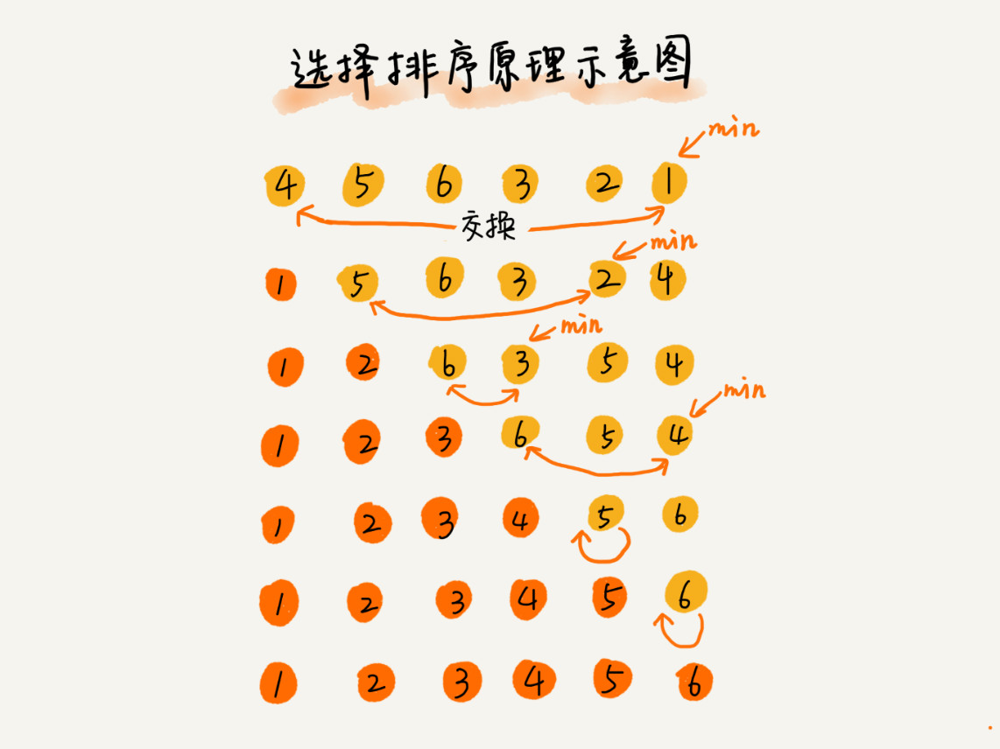

# 排序（上）：为什么插入排序比冒泡排序更受欢迎?

### 1.	排序算法
猴子排序、睡眠排序、面条排序、冒泡排序、插入排序、选择排序、归并排序、快速排序、计数排序、基数排序、桶排序。


插入排序和冒泡排序的时间复杂度相同，都是O(n2)


### 2.	如何分析一个“排序算法”？
1）最好情况、最坏情况、平均情况时间复杂度

2）	时间复杂度的系数、常数 、低阶

3）比较次数和交换（或移动）次数


### 3.	排序算法的内存消耗
原地排序 ：原地排序算法，就是特指空间复杂度是O(1)的排序算法。


### 4.	排序算法的稳定性
稳定排序算法可以保持金额相同的两个对象，在排序之后的前后顺序不变


## 冒泡排序（Bubble Sort）

是原地排序算法、是稳定排序、时间复杂度O(n2)
```
// 冒泡排序，a表示数组，n表示数组大小
public void bubbleSort(int[] a, int n) {
  if (n <= 1) return;
 
 for (int i = 0; i < n; ++i) {
    // 提前退出冒泡循环的标志位
    boolean flag = false;
    for (int j = 0; j < n - i - 1; ++j) {
      if (a[j] > a[j+1]) { // 交换
        int tmp = a[j];
        a[j] = a[j+1];
        a[j+1] = tmp;
        flag = true;  // 表示有数据交换      
      }
    }
    if (!flag) break;  // 没有数据交换，提前退出
  }
}
```
[个人理解：]()数组从第一个元素开始与后面所有元素比较，找到最大的冒泡到最后,不发生替换后退出。


## 插入排序（Insertion Sort）

首先，我们将数组中的数据分为两个区间，已排序区间和未排序区间。初始已排序区间只有一个元素，就是数组的第一个元素。插入算法的核心思想是取未排序区间中的元素，在已排序区间中找到合适的插入位置将其插入，并保证已排序区间数据一直有序。重复这个过程，直到未排序区间中元素为空，算法结束。
```
// 插入排序，a表示数组，n表示数组大小
public void insertionSort(int[] a, int n) {
  if (n <= 1) return;

  for (int i = 1; i < n; ++i) {
    int value = a[i];
    int j = i - 1;
    // 查找插入的位置
    for (; j >= 0; --j) {
      if (a[j] > value) {
        a[j+1] = a[j];  // 数据移动
      } else {
        break;
      }
    }
    a[j+1] = value; // 插入数据
  }
}
```
插入排序是原地排序算法、插入排序是稳定的排序算法、平均时间复杂度为O(n2)

[个人理解：]()除第一个元素外，拿n-1个元素分别与元素前面的元素进行对比,移动满足条件的，把当前元素插入到该有位置。

## 选择排序（Selection Sort）



原地排序算法、不是稳定的排序

执行一个赋值语句的时间粗略地计为单位时间（unit_time），然后分别用冒泡排序和插入排序对同一个逆序度是K的数组进行排序。用冒泡排序，需要K次交换操作，每次需要3个赋值语句，所以交换操作总耗时就是3*K单位时间。而插入排序中数据移动操作只需要K个单位时间。

[个人理解：]()虽然冒泡排序和插入排序在时间复杂度上是一样的，都是O(n2)，但是如果我们希望把性能优化做到极致，那肯定首选插入排序。

## 内容小结

这三种时间复杂度为O(n2)的排序算法中，冒泡排序、选择排序，可能就纯粹停留在理论的层面了，学习的目的也只是为了开拓思维，实际开发中应用并不多，但是插入排序还是挺有用的。

## 课后思考
如果数据存储在链表中，这三种排序算法还能工作吗？如果能，那相应的时间、空间复杂度又是多少呢？

[个人理解：]()
链表冒泡、插入排序、选择排序可以工作
时间复杂度：磁盘复杂度是否更大？