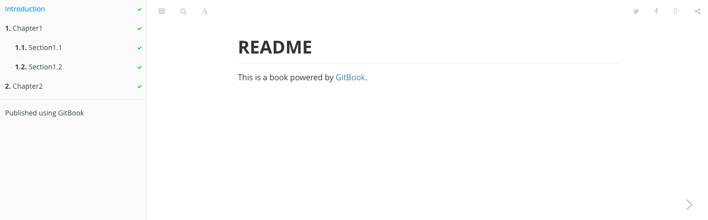

# gitbook

## 1、安装

首先需要安装 nodejs，以便能够使用 npm 来安装 gitbook。
```
$ npm install gitbook -g
```

## 2、使用

gitbook 的基本用法非常简单，基本上就只有两步：

* 使用 gitbook init 初始化书籍目录
* 使用 gitbook serve 编译书籍

下面将结合一个非常简单的实例，来介绍 gitbook 的基本用法。
### gitbook init

```
$ tree book/
book/
├── README.md
└── SUMMARY.md

```
README.md 和 SUMMARY.md 是两个必须文件，README.md 是对书籍的简单介绍：

```
$ cat book/README.md 
# README

This is a book powered by [GitBook](https://github.com/GitbookIO/gitbook).
```

SUMMARY.md 是书籍的目录结构。内容如下：

```
$ cat book/SUMMARY.md 
# SUMMARY

* [Chapter1](chapter1/README.md)
  * [Section1.1](chapter1/section1.1.md)
  * [Section1.2](chapter1/section1.2.md)
* [Chapter2](chapter2/README.md)
```
### gitbook serve

书籍目录结构创建完成以后，就可以使用 gitbook serve 来编译和预览书籍了：

```
$ gitbook serve
Press CTRL+C to quit ...

Live reload server started on port: 35729
Starting build ...
Successfully built!

Starting server ...
Serving book on http://localhost:4000
```
现在，可以用浏览器打开 http://127.0.0.1:4000 查看书籍的效果，如下图：



现在，gitbook 为我们创建了书籍目录结构后，就可以向其中添加真正的内容了，文件的编写使用 markdown 语法，在文件修改过程中，每一次保存文件，gitbook serve 都会自动重新编译，所以可以持续通过浏览器来查看最新的书籍效果！

## 3、关联github、 gitbook

* github 作为代码仓库，可以多人协作；
* gitbook 作为生成在线书籍；

github 与gitbook.com 可以做关联，每当在github push代码，gitbook.com同步内容，更新电子书。

1、 [加入github eqxiudev organisation](https://github.com/eqxiudev)

2、 [加入gitbook organisation（要翻墙）](https://www.gitbook.com/invite/eqxiu?invite=-L_ekZGCIl3Xrs2wh3Pe)

3、 github push 内容，gitbook.com 自动更新